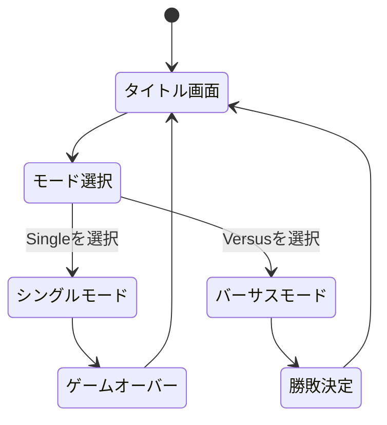
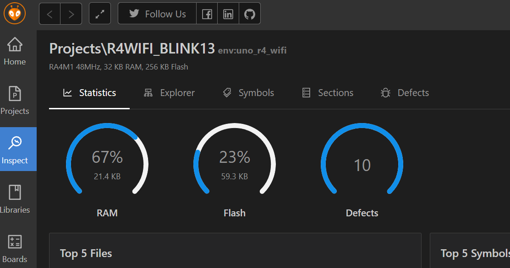
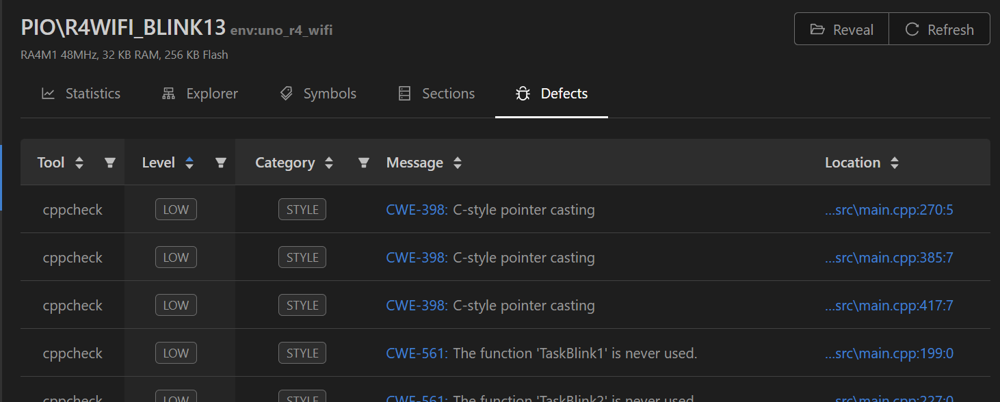

# 卒業制作 2025


## 目次

- [概要](#概要)
  - [主な特徴](#主な特徴)
- [構成](#構成)
  - [ハードウェア構成](#ハードウェア構成)
    - [使用部品](#使用部品)
    - [ブレッドボード図](#ブレッドボード図)
    - [回路図](#回路図)
  - [ソフトウェア構成](#ソフトウェア構成)
    - [クライアントの使用ライブラリ](#クライアントの使用ライブラリ)
    - [クライアントのディレクトリ構成](#クライアントのディレクトリ構成)
    - [サーバーの使用パッケージ](#サーバーの使用パッケージ)
    - [サーバーのディレクトリ構成](#サーバーのディレクトリ構成)
- [セットアップ](#セットアップ)
  - [Arduino側のセットアップ](#arduino側のセットアップ)
    - [手順](#手順)
  - [サーバー側のセットアップ(バーサスモードをプレイする場合)](#サーバー側のセットアップバーサスモードをプレイする場合)
    - [手順](#手順-1)
- [ゲームの仕様](#ゲームの仕様)
  - [Single Mode（シングルモード）](#single-modeシングルモード)
  - [Versus Mode（バーサスモード）](#versus-modeバーサスモード)
  - [通信の際の注意点](#通信の際の注意点)
  - [ゲームの遷移図](#ゲームの遷移図)
- [工夫した点など](#工夫した点など)
- [今後の課題](#今後の課題)
- [本プロジェクトで使用しているツール・技術について](#本プロジェクトで使用しているツール・技術について)
  - [PlatformIO](#platformio)
  - [Node.js](#nodejs)
  - [WebSocket](#websocket)
- [参考](#参考)

## 概要

本プロジェクトは**Arduino UNO R4 WiFi(以降、Arduino)で動作する<ins>対戦型シューティングゲーム**</ins>です。  

### 主な特徴

- 開発には<ins>**PlatformIO**</ins>を使用し**実務レベルのビルド管理・静的コード解析**を実施
- ゲームモードは、「**シングルモード**」と「**バーサスモード**」の二種類
- **シングルモード**はArduino単体で動作する**スタンドアロン構成**
- **バーサスモード**ではArduinoに搭載されている**ESP32のWiFi機能**を使用して<ins>**Node.js</ins>で構築した<ins>WebSocketサーバー**</ins>と**リアルタイム双方向通信**を行う
- Node.jsの**ノンブロッキングI/Oモデル**により、サーバーの**高い応答性**を実現
- 通信を<ins>**バイナリ形式**</ins>で行うことで**データ量を大幅に削減**し、さらにゲームの更新処理に<ins>**タイマー割り込み**</ins>を用いることで**高いリアルタイム性**を確保  
- **フラッシュメモリの<ins>仮想的なEEPROM領域**</ins>を活用し、**ハイスコアの永続保存**を実現
- ディスプレイには**OLED**を採用し、**高い視認性**を実現
- 入力装置は**アナログスティック１つ＋ボタン一つ**の**シンプルな入力設計**

<ins>*WebSocketを導入するにあたり使用できるライブラリが存在しなかったので自前でWebSocketClientクラスを実装*</ins>

## 構成

### ハードウェア構成

#### 使用部品

| 部品名                   | 数量 | 備考               |
| --------------------- | -- | ---------------- |
| Arduino Uno R4 WiFi   | 1個 | マイコン本体（Wi-Fi付き）  |
| ディスプレイ（OLEDなど）        | 1個 | I2C接続が可能なもの        |
| アナログスティック             | 1個 | 操作に使用　スイッチは未使用   |
| タクトスイッチ（ボタン）          | 1個 | 入力用          |
| 抵抗 10kΩ               | 1個 | プルダウンに使用 |
| セラミックコンデンサ 104（0.1µF） | 1個 | ジッター排除に使用  |
| ジャンパワイヤ | 約15個 | ブレッドボード図のワイヤー分＋スコアリセット用  |

---

#### ブレッドボード図


#### 回路図


---

### ソフトウェア構成

#### クライアントの使用ライブラリ

| ライブラリ名              | 説明                               | 標準ライブラリか |
| ------------------- | ----------------------------------- | ------- |
| Arduino.h           | Arduinoの基本機能（GPIO制御やタイミング処理など）を提供する | ○       |
| EEPROM.h            | EEPROMへの読み書きを行うためのライブラリ             | ○       |
| stdlib.h            | メモリ確保・乱数生成などの標準Cライブラリ機能を提供する        | ○       |
| stdint.h            | サイズが固定された整数型（uint8\_tなど）を定義する     | ○       |
| Wire.h              | I2C通信を行うためのライブラリ                    | ○       |
| SPI.h               | SPI通信を行うためのライブラリ                    | ○       |
| FspTimer.h          | UNO R4のタイマーを制御するための専用ライブラリ（割り込みなど）  | ×       |
| WiFiS3.h            | UNO R4 WiFiの無線通信機能を制御するライブラリ        | ×       |
| Adafruit\_GFX.h     | OLEDなどのディスプレイ向けにグラフィック描画機能を提供する     | ×       |
| Adafruit\_SSD1306.h | SSD1306ディスプレイを制御するためのライブラリ          | ×       |

#### クライアントのディレクトリ構成

```txt
client/
 ├───.gitignore
 ├───platformio.ini
 ├───.pio/...
 ├───.vscode/
 │   ├───extensions.json
 │   └───settings.json
 ├───config/
 │   └───arduino_secrets.h
 ├───include/
 │   ├───bullet.h
 │   ├───enemy.h
 │   ├───function.h
 │   ├───game.h
 │   ├───objBase.h
 │   ├───objManager.h
 │   ├───player.h
 │   ├───scene_singleMode.h
 │   ├───scene_title.h
 │   ├───scene_versusMode.h
 │   ├───sceneBase.h
 │   ├───sceneManager.h
 │   ├───types.h
 │   └───WebSocketClient.h
 ├───lib/
 │   └───README
 ├───src/
 │   ├───bullet.cpp
 │   ├───main.ino
 │   ├───enemy.cpp
 │   ├───function.cpp
 │   ├───game.cpp
 │   ├───objManager.cpp
 │   ├───player.cpp
 │   ├───scene_singleMode.cpp
 │   ├───scene_title.cpp
 │   ├───scene_versusMode.cpp
 │   └───WebSocketClient.cpp
 └───test/
     └───README
```

---

#### サーバーの使用パッケージ

| パッケージ名   | 用途の説明                    |
| -------- | ------------------------ |
| ws       | WebSocket通信を実装するためのパッケージ |

#### サーバーのディレクトリ構成

```txt
server/
├── .gitignore
├── node_modules/
├── package-lock.json
├── package.json
└── server.js
```

## セットアップ

※事前に上記のブレッドボード図を参考に回路を作っておく必要があります。

### Arduino側のセットアップ

セットアップに使用する統合環境は**VSCode**を想定しています。  
もし、VSCodeがインストールされていない場合、<ins>以下の公式サイトからインストールを行ってください。</ins>

- <https://code.visualstudio.com/>

また、日本語化拡張機能「**Japanese Language Pack for Visual Studio Code**」のインストールを推奨します  
　<small>※以降はJapanese Language Pack for Visual Studio Codeを導入していることを前提に説明します。</small>

#### 手順

1. **PlatformIOのインストール**

   - VSCodeの拡張機能としてPlatformIOをインストールします。

2. **プロジェクトを開く**

   - VSCodeを起動し、画面左上のメニューの「ファイル」をクリックし、「フォルダで開く...」を選択し、このプロジェクトに含まれる`client`フォルダを開きます。

3. **アクセスポイントとサーバーの設定**

   - `client/config/arduino_secrets.h`を開き、以下のマクロ定義をそれぞれご自身の環境に合わせて編集・保存してください。

        ```c
        //アクセスポイント
        #define SECRET_SSID "your SSID"         //SSID
        #define SECRET_PASS "your PASS"         //パスワード
        //サーバー
        #define WEBSOCKET_IP "your WebSocket ip"//ipアドレス
        #define WEBSOCKET_PORT 18080            //ポート番号
        ```

4. **Arduinoへのプログラムの書き込み**

    - ArduinoボードのType-CポートとPCを接続します。
    - 左のメニューのPlatformIOアイコンをクリックします。
    - しばらくするとPlatformIOのメニューが出てくるので「Pick a folder」をクリックし、`client`フォルダを選択します。(自動でフォルダが選択される場合もあります)
    - 「PROJECT TASKS」の項目から「Upload」を選択するとArduinoへのプログラムの書き込みがスタートします。
    - 書き込みが完了するとディスプレイにロゴが表示されます。

---

### サーバー側のセットアップ(バーサスモードをプレイする場合)

もし、**Node.js**がインストールされていない場合、<ins>以下のサイトを参考にNode.jsのインストールを行ってください。</ins>

- <https://learn.microsoft.com/ja-jp/windows/dev-environment/javascript/nodejs-on-windows>

#### 手順

1. **依存関係のインストール**

    - VSCodeで`server`フォルダを開き、ターミナルで以下のコマンドを実行して依存関係のインストールを行います。

    ```bash
    npm ci
    ```

    - `npm install`ではなく`npm ci`にすることでバージョンの一貫性を保つことができます。

2. **サーバーの起動**

    - ターミナルで以下のコマンドを実行することでサーバーが起動します。

    ```bash
    node server.js
    ```

3. **サーバーの停止**

    - サーバーを終了させるには`Ctrl+C`を入力してください。

## ゲームの仕様

電源投入後、タイトルロゴが表示され、続いてゲームモード選択画面が表示されます。  
このとき、**12番ピンをGNDに接続**しておくと、後述の**シングルモードのハイスコアをリセット**することが可能です。


本ゲームには、以下の2つのモードがあります。

1. **Single Mode（シングルモード）**

    - 一人プレイ用のモード。残機がなくなるまでに何回敵に弾を当てられるかに挑戦する。

1. **Versus Mode（バーサスモード）**

    - WiFiを用いた二人プレイ用のモード。ネットワークを介して2台のArduino同士がリアルタイムで対戦する

アナログスティックを使ってモードを選択し、ボタンを押すことでゲームがスタートします。

以下にそれぞれのゲームの詳細を記述します。

---

### Single Mode（シングルモード）


一人プレイ用のモードです。
このモードではランダムな位置にワープを繰り返す敵に弾を当ててハイスコアを目指します。  
敵の弾に当たるとプレイヤーの残機が減っていき、0になった状態で弾に当たるとゲームオーバーです。  
時間経過でプレイヤーも敵も発射する弾の数が上昇していきます。  
ハイスコアは電源を落としても保持されます(ハイスコアを消去したい場合は [ゲームの仕様](#ゲームの仕様)の冒頭に記載の手順を行ってください。)  

---

### Versus Mode（バーサスモード）


WiFiを用いた二人プレイ用のモードです。  
このモードを選択するとまずアクセスポイントとWebSocketへの接続が順番に実行されます。  
　<small>※アクセスポイントのSSIDとパスワード、WebSocketのipアドレスとポートはそれぞれ`arduino_secrets.h`に記載のものが使用されます。</small>  
接続が完了すると対戦相手がサーバーに接続されるまで待機し、接続されると対戦が始まります。  
対戦では互いの自機が自動で弾を発射するので、スティックを動かして相手の弾を避けつつ攻撃し、先に相手のライフを削り切ったプレイヤーが勝利です。  
シングルモードと同じく時間経過で互いに発射する弾の数が上昇していきます。

#### 通信の際の注意点

- アクセスポイントは**必ず2.4GHz帯**を使用してください。ArduinoUNOR4WiFiに限らずほとんどのIot機器は2.4GHzにしか対応していません。
- アクセスポイント、WebSocketサーバーへの接続に失敗した際はリセットボタンを押してください。
- サーバーのIPアドレスは**DHCP環境では再起動や時間経過によって変化する可能性があります**。その場合は都度`arduino_secrets.h`の**WEBSOCKET_IP**を変更してください。IPアドレスを固定しておくと変動を防げます。

---

### ゲームの遷移図



## 工夫した点など

- **HTTPからWebSocketに変更**し、リクエスト・レスポンス方式の制約を解消して**リアルタイム性を向上**
- WebSocketによるJSON形式の通信スタックを自作して導入。その後、パフォーマンス改善のため**バイナリ形式**に変更し、**遅延を大幅に削減**
- 当初のloop関数によるゲームの更新から、ゲームのリアルタイム性向上のため、**タイマー割り込み**でのゲームの更新に変更
- ゲームオブジェクトや各シーンを**クラス化**し、**拡張性や再利用性を向上**

## 今後の課題

- BGMや効果音がないため、モジュールを駆使してサウンドを再生する仕組みを作る。
- 最大４人で対戦できるようにする。
- 現時点では単に弾を撃つだけなので、弾をすり抜けたり、シールドを張るといったスキルを追加してゲーム性を向上させる。
- シューティングゲームだけではなく様々なゲームを遊べるようにする。

## 本プロジェクトで使用しているツール・技術について

### PlatformIO

公式サイト

- <https://platformio.org/>

PlatformIO は、組み込みシステム エンジニアや組み込み製品向けアプリケーションを作成するソフトウェア開発者向けの、クロスプラットフォーム、クロスアーキテクチャ、マルチフレームワーク対応のプロフェッショナルな開発ツールです。  非常に多くのフレームワークをサポートしているのが特徴で、ビルドやデバッグといった基本機能だけではなくテストやコード解析など幅広い機能を備えています。


*PlatformIOによるコード解析の例*

---


*Inspectのcppチェックの結果*

---

### Node.js

公式サイト

- <https://nodejs.org/ja>

Node.jsは、サーバーサイドでJavaScriptを実行するためのオープンソースのランタイム環境です。
ノンブロッキングI/Oモデルを採用しているのが特徴で、大量のアクセスに強く、Webサイトやリアルタイム性が求められる場面に適しています。  
また、JavaScriptと高度な互換性をもつTypeScriptが使えることも特徴の一つです。

本プロジェクトではWebSocketサーバーの構築に使用しています。

---

### WebSocket

Wikipedia

- <https://ja.wikipedia.org/wiki/WebSocket>

WebSocketは、双方向通信を行うためのコンピュータの通信プロトコルの一つです。  
HTTPと違い、一度接続を確立すると以降はサーバー側からもクライアント側からも独立してデーターを送信することが可能です。  
これにより、リアルタイム性が求められる場面でも効率的にデータを送受信が可能です。

## 参考

- [SunFounder Elite Explorer Kit 日本語ドキュメント](https://docs.sunfounder.com/projects/elite-explorer-kit/ja/latest/index.html)
- [Arduino Documentation](https://docs.arduino.cc/)
- [PlatformIO IDE for VSCodeの設定](https://docs.leafony.com/docs/environment/esp32/platformio/)
- [Windows に Node.js をインストールする](https://learn.microsoft.com/ja-jp/windows/dev-environment/javascript/nodejs-on-windows)
- [【Mac】node.jsのWebサーバーを作る【VSCODE】](https://hombre-nuevo.com/javascript/nodejs0001/)
- [ArduinoCore-renesas](https://github.com/arduino/ArduinoCore-renesas/tree/main)
- [Arduino UNO R4 でタイマー割り込みを使う](https://workshop.aaa-plaza.net/archives/1658)
