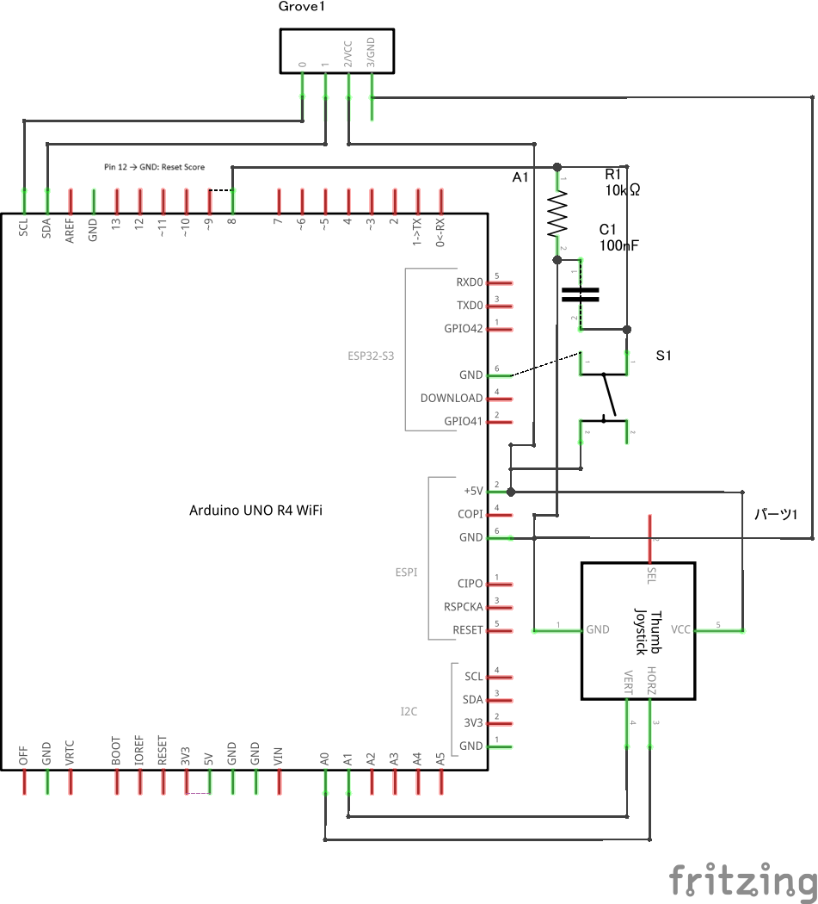
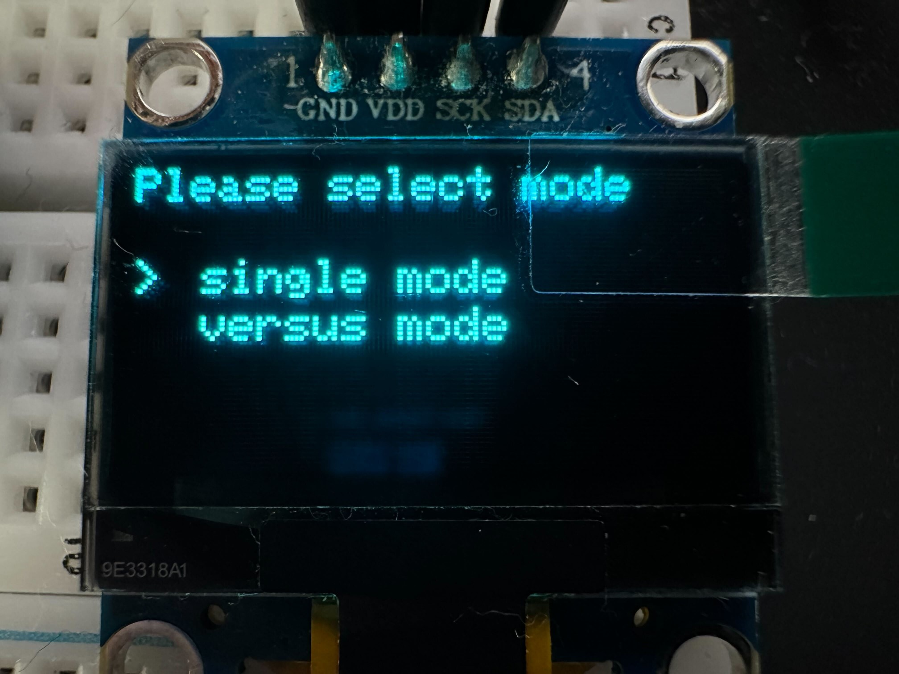
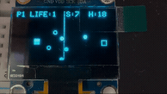

# 卒業制作 2025


## 概要

本プロジェクトはArduino UNO R4 WiFi(以降より、Arduino)で動作する対戦型シューティングゲームです。
Arduinoに搭載されているESP32のWiFi機能を使用したリアルタイム対戦が可能です。

## 構成

### ハードウェア構成

#### 使用部品

| 部品名                   | 数量 | 備考               |
| --------------------- | -- | ---------------- |
| Arduino Uno R4 WiFi   | 1個 | マイコン本体（Wi-Fi付き）  |
| ディスプレイ（OLEDなど）        | 1個 | I2C接続が可能なもの        |
| アナログスティック             | 1個 | 操作に使用　スイッチは未使用   |
| タクトスイッチ（ボタン）          | 1個 | 入力用          |
| 抵抗 10kΩ               | 1個 | プルダウンに使用 |
| セラミックコンデンサ 104（0.1µF） | 1個 | ジッター排除に使用  |
| ジャンパワイヤ | 約15個 | ブレッジボード図のワイヤー分＋スコアリセット用  |

---

#### ブレッドボード図


#### 回路図



### ソフトウェア構成

#### クライアントの使用ライブラリ

| ライブラリ名              | 説明                               | 標準ライブラリか |
| ------------------- | ----------------------------------- | ------- |
| Arduino.h           | Arduinoの基本機能（GPIO制御やタイミング処理など）を提供する | ○       |
| EEPROM.h            | EEPROMへの読み書きを行うためのライブラリ             | ○       |
| stdlib.h            | メモリ確保・乱数生成などの標準Cライブラリ機能を提供する        | ○       |
| stdint.h            | サイズが固定された整数型（例：uint8\_tなど）を定義する     | ○       |
| Wire.h              | I2C通信を行うためのライブラリ                    | ○       |
| SPI.h               | SPI通信を行うためのライブラリ                    | ○       |
| FspTimer.h          | UNO R4のタイマーを制御するための専用ライブラリ（割り込みなど）  | ×       |
| WiFiS3.h            | UNO R4 WiFiの無線通信機能を制御するライブラリ        | ×       |
| Adafruit\_GFX.h     | OLEDなどのディスプレイ向けにグラフィック描画機能を提供する     | ×       |
| Adafruit\_SSD1306.h | SSD1306ディスプレイを制御するためのライブラリ          | ×       |

#### クライアントのディレクトリ構成

```txt
client/
 ├───.gitignore
 ├───platformio.ini
 ├───.pio/...
 ├───.vscode/
 │   ├───extensions.json
 │   └───settings.json
 ├───config/
 │   └───arduino_secrets.h
 ├───include/
 │   ├───bullet.h
 │   ├───enemy.h
 │   ├───function.h
 │   ├───game.h
 │   ├───objBase.h
 │   ├───objManager.h
 │   ├───player.h
 │   ├───scene_singleMode.h
 │   ├───scene_title.h
 │   ├───scene_versusMode.h
 │   ├───sceneBase.h
 │   ├───sceneManager.h
 │   ├───types.h
 │   └───WebSocketClient.h
 ├───lib/
 │   └───README
 ├───src/
 │   ├───bullet.cpp
 │   ├───client_ws.ino
 │   ├───enemy.cpp
 │   ├───function.cpp
 │   ├───game.cpp
 │   ├───objManager.cpp
 │   ├───player.cpp
 │   ├───scene_singleMode.cpp
 │   ├───scene_title.cpp
 │   ├───scene_versusMode.cpp
 │   └───WebSocketClient.cpp
 └───test/
     └───README
```

---

#### サーバーの使用パッケージ

| パッケージ名   | 用途の説明                    |
| -------- | ------------------------ |
| ws       | WebSocket通信を実装するためのパッケージ |


#### サーバーのディレクトリ構成

```txt
server/
├── node_modules/
├── npm
├── package-lock.json
├── package.json
└── server.js
```

## セットアップ

事前に上記のブレッドボード図を参考に回路を作ってください。

### Arduino側のセットアップ

1. ArduinoIDEがインストールされていない場合、以下のサイトからインストールを行ってください

    - <https://www.arduino.cc/en/software/>

2. 以下のライブラリをインストールしてください

    - `FspTimer.h`
    - `WiFiS3.h`
    - `Adafruit_GFX.h`
    - `Adafruit_SSD1306.h`

3. `client/config/arduino_secrets.h`のアクセスポイントのSSID、パスワードとサーバーのipアドレス、ポート番号のマクロ定義をそれぞれご自身の環境に合わせて書き換えて保存してください。  
4. `client/src/main.ino`をArduinoIDEで開き、Arduinoにプログラムの書き込みを行ってください。

---

### サーバー側のセットアップ(バーサスモードをプレイする場合)

1. 事前にNode.jsがインストールされていなければ以下のサイトを参考にインストールを行ってください。

    - <https://learn.microsoft.com/ja-jp/windows/dev-environment/javascript/nodejs-on-windows>

1. VSCodeでserverフォルダを開き、以下のコマンドを実行することで依存関係のインストールを行ってください。

    ```bash
    npm install
    ```

1. さらに以下のコマンドを実行することでサーバーが起動します。

    ```bash
    node server.js
    ```

1. 終了させるにはCtrl+Cを入力する

## ゲームの仕様

電源投入後、タイトルロゴが表示され、続いてゲームモード選択画面が表示されます。  
このとき、12番ピンをGNDに接続しておくと、後述のシングルモードのハイスコアをリセットすることが可能です。



本ゲームには、以下の2つのモードがあります。

1. **Single Mode（シングルモード）**

    - 一人プレイ用のモード。残機がなくなるまでに何回敵に弾を当てられるかに挑戦する。

1. **Versus Mode（バーサスモード）**

    - WiFiを用いた二人プレイ用のモード。ネットワークを介して2台のArduino同士がリアルタイムで対戦する

アナログスティックを使ってモードを選択し、ボタンを押すことでゲームを開始します。

以下にそれぞれのゲームの詳細を記述します。

---

### Single Mode（シングルモード）



一人プレイ用のモードです。ランダムな位置にワープを繰り返す敵に弾を当ててハイスコアを目指します。  
敵の弾に当たるとプレイヤーの残機が減っていき、0になった状態で弾に当たるとゲームオーバーとなります。
時間経過でプレイヤーも敵も発射する弾の数が上昇していきます。
ハイスコアは電源を落としても保持されます(ハイスコアを消去したい場合は上記記載の手順を行ってください。)  

---

### Versus Mode（バーサスモード）


WiFiを用いた二人プレイ用のモードです。  
このモードを選択するとまずアクセスポイントとWebSocketへの接続が順番に実行されます。  
　＊アクセスポイントのSSIDとパスワード、WebSocketのipアドレスとポートはそれぞれ`arduino_secrets.h`に記載のものが使用されます。  
接続が完了すると対戦相手もサーバーに接続されるまで待機し、対戦相手が接続サーバーに接続されるとゲームがスタートします。  
対戦では互いの自機が自動で弾を発射するので、スティックをうごかして相手の弾を避けつつ攻撃し、先に相手のライフを削り切ったプレイヤーの勝利となります。  
シングルモードと同じく時間経過で互いに発射する弾の数が上昇していきます。

---

## 今後の課題

- BGMや効果音がないため、モジュールを駆使してサウンドを再生する仕組みを作る。
- 最大４人で対戦できるようにする。
- シューティングゲームだけではなく様々なゲームを遊べるようにするのも良いかもしれない。
